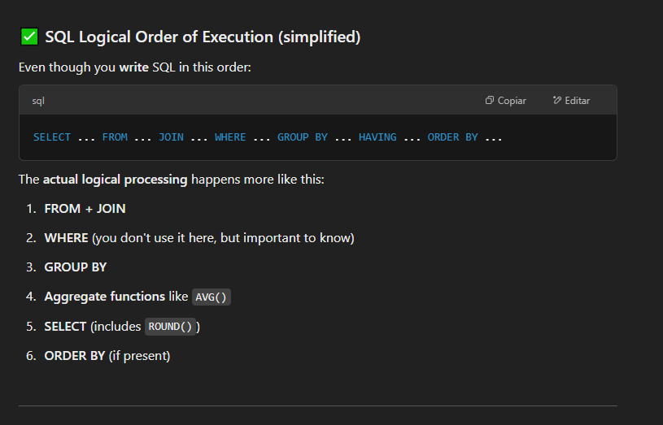
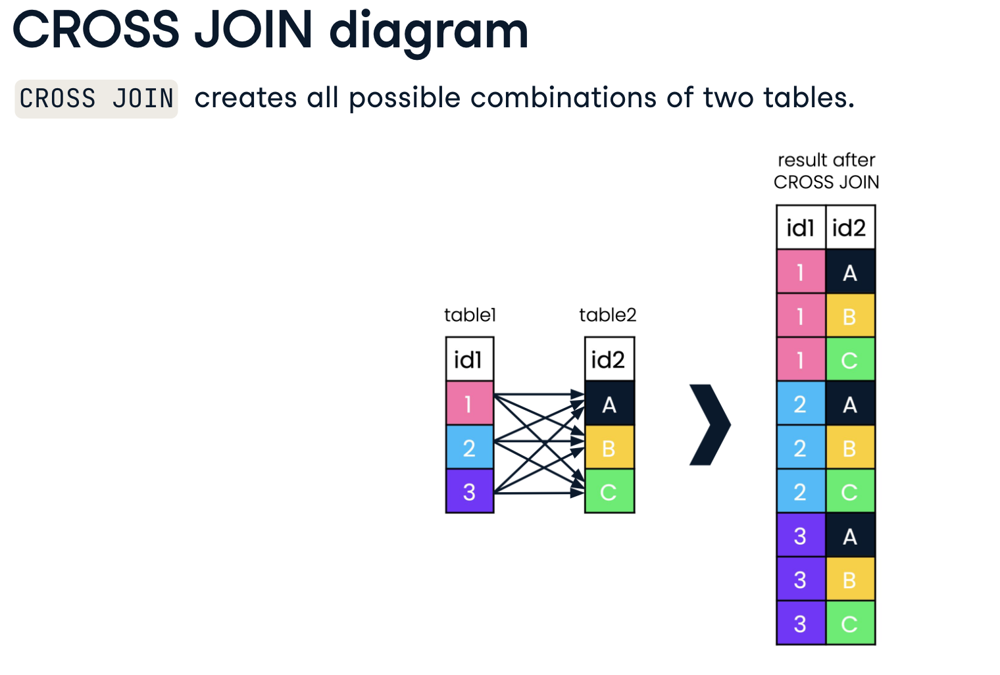

# SQL solver
Solving differents problems using SQL (platforms like leetcode, hackerrank...)

## What's the purpose?
To learn and improve sql skills

| Problem                                | My personal difficulty | Techniques and comments                              | Platform | Solution|
| -------------------------------------- | ---------------------- | ---------------------------------------------------- | ---- | ---- |
| 180. Consecutive Numbers  | medium-hard  | `INNER JOIN`  | Leetcode | [SQL](solutions/180_ConsecutiveNumbers.sql) |
| 182. Duplicate Emails     | easy-medium  | CTE + `COUNT` + `HAVING` | Leetcode | [SQL](solutions/182_DuplicateEmails.sql) |
| 197. Rising Temperature     | easy-medium | `dateDiff` | Leetcode | [SQL](solutions/197_RisingTemperature.sql) |
| 577. Employee Bonus     | easy  | `LEFT JOIN` + `NULL`  | Leetcode | [SQL](solutions/577_EmployeeBonus.sql) |
| 610. Triangle Judgement   | medium  | you need to know or conclude a simple rule for form a triangle $l_i + l_j > l_z$  | Leetcode | [SQL](solutions/610_TriangleJudgement.sql) |
| 619. Biggest Single Number  | easy-medium  | `GROUP BY`, `HAVING`, `COUNT`, CTE and `MAX`  | Leetcode | [SQL](solutions/619_BiggestSingleNumber.sql) |
| 620. Not Boring Movies  | easy  | modulo operation `%` and strings operations with booleans for example `NOT LIKE %sub-string%`  | Leetcode | [SQL](solutions/620_NotBoringMovies.sql) |
| 627. Swap Salary  | easy  | `UPDATE` this time and use of `CASE` with a `ENUM` data type  | Leetcode | [SQL](solutions/627_SwapSalary.sql) |
| 1068. Product Sales Analysis I  | easy  | `<table> AS T1 INNER JOIN <other table> AS T2 ON T1.foreignKey = T2.id`  | Leetcode | [SQL](solutions/1068_ProductSalesAnalysisI.sql) |
| 1075. Project Employees I  | easy  | `INNER JOIN` + `ROUND(, x)` + `AVG()`  | Leetcode | [SQL](solutions/1075_ProjectEmployeesI.sql) |
| 1084. Sales Analysis III  | medium  | `CTE` and ranges about dates  | Leetcode | [SQL](solutions/1084_SalesAnalysisIII.sql) |
| 1280. Students and Examinations  | medium  | `CTE` + `COUNT` + `COALESCE` for fill with zeros + `CROSS JOIN` for add to each individual 3 attributes as rows  | Leetcode | [SQL](solutions/1280_StudentsAndExaminations.sql) |
| 1378. Replace Employee ID With The Unique Identifier  | easy  | `LEFT JOIN`  | Leetcode | [SQL](solutions/1378_ReplaceEmployeeIDWithTheUniqueIdentifier.sql) |
| 1393. Capital Gain/Loss  | medium-hard  | Use `SUM` with `CASE WHEN`  | Leetcode | [SQL](solutions/1393_CapitalGainLoss.sql) |
| 1581. Customer Who Visited but Did Not Make Any Transactions  | easy-medium  | Use `COUNT` + `IS NULL`  | Leetcode | [SQL](solutions/1581_CustomerWhoVisitedButDidNotMakeAnyTransactions.sql) |
| 1683. Invalid Tweets  | easy  | Use `LENGTH` for check the number of characters of string on each row per column  | Leetcode | [SQL](solutions/1683_InvalidTweets.sql) |
| 3465. Find Products with Valid Serial Numbers | easy-medium  | `REGEXP` | Leetcode | [SQL](solutions/3465_FindProductsWithValidSerialNumbers.sql) |
| 3475. DNA Pattern Recognition   | medium-hard  | you need to know `REGEXP` and `CASE WHEN`  | Leetcode | [SQL](solutions/3475_DNAPatternRecognition.sql) |

# New Concepts learned + some interesting references
* CTE's for SQL: https://builtin.com/data-science/advanced-sql
    -  A CTE (common table expression) is a temporary, named result set defined within an SQL query using the WITH keyword, which is used to simplify complex queries by breaking them into smaller, more manageable parts.
* `HAVING` SQL, condition used for aggregate functions: https://www.w3schools.com/sql/sql_having.asp
* `dateDiff` : difference between two days, in this case must be on days.
* `NULL`: Represents the absence of a value, this means "unknown" or "not applicable" in a database (chatgpt answer). 
* `CASE`: Implementation of CASE https://www.w3schools.com/sql/sql_case.asp
* `ENUM`: https://www.geeksforgeeks.org/enumerator-enum-in-mysql/
    * The `ENUM` data type in MySQL is a string object that allows us to limit the value chosen from a list of permitted values in the column specification at the time of column creation.
    * `ENUM` values are stored as integers (1, 2, 3, …) behind the scenes, which is more space-efficient than storing strings.
* `CROSS JOIN`:
    * [datacamp references](https://campus.datacamp.com/courses/joining-data-in-sql/outer-joins-cross-joins-and-self-joins?ex=9)

* `COALESCE` : The COALESCE() function in SQL returns the first non-null value from a list of expressions. If all values are null, it returns null. It’s commonly used to handle missing values or combine multiple columns into one fallback output. [datacamp reference](https://www.datacamp.com/tutorial/coalesce-sql-function?utm_source=google&utm_medium=paid_search&utm_campaignid=21057859163&utm_adgroupid=157296744937&utm_device=c&utm_keyword=&utm_matchtype=&utm_network=g&utm_adpostion=&utm_creative=733936255628&utm_targetid=aud-2191467489990:dsa-2218886984820&utm_loc_interest_ms=&utm_loc_physical_ms=1003332&utm_content=ps-other~latam-en~dsa~tofu~tutorial-sql&accountid=9624585688&utm_campaign=230119_1-ps-other~dsa~tofu_2-b2c_3-latam-en_4-prc_5-na_6-na_7-le_8-pdsh-go_9-nb-e_10-na_11-na&gad_source=1&gclid=Cj0KCQjwqv2_BhC0ARIsAFb5Ac-A9-wTxddEycNbgYRf_MnxkaQiEeIbQPpt206zkdWrz6zM3VJFLr0aAo4XEALw_wcB)
